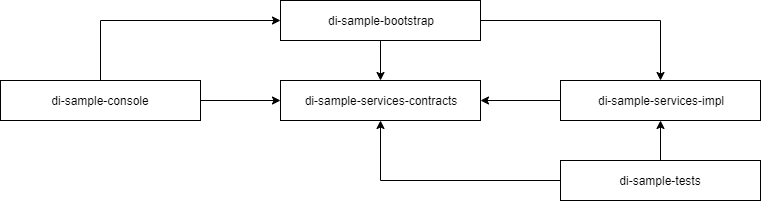

Dependency Injection Sample
===========================

Overview
--------

This is a sample project written in Java using IntelliJ IDEA that demonstrates an approach to writing a modular software application that utilizes dependency injection.
It's intended to provide a clear understanding of what dependency injection is and why it should be used.

Requirements
------------

In order to use this project, you will need:

- [IntelliJ IDEA](https://www.jetbrains.com/idea)
- [Java 11 JDK](https://www.oracle.com/java)
- Maven (available as IntelliJ IDEA plugin)

External Libraries
------------------

The following external libraries are retrieved through Maven repositories:

- [Google Guice](https://github.com/google/guice): open source dependency injection framework for Java created by Google
- [JUnit](https://junit.org): open source testing framework for Java

What Is A Dependency?
---------------------

In the context of a software application, a dependency is something that the application relies on to support its functionality.
This could be as simple as one Java class relying on another, or the application as a whole relying on a file system or database for storing data.
The more dependencies a software application has, the more complex it is to maintain and evolve, especially if those dependencies are hard to change or replace.

What Is Dependency Injection?
-----------------------------

Dependency injection is a design pattern whereby an object's dependencies are created externally and provided (or "injected") to the object once they have been created.
In Java, a class that has dependencies would leave the responsibility of instantiating these dependencies to something else outside of the class and would only
specify which dependencies it requires in order to achieve its own desired behaviour.

For example, in this project the `AdvancedNumberService` class specifies a dependency on the `Randomizer` interface via its constructor:

    public AdvancedNumberService(Randomizer randomizer)
    {
        ...
    }

This means that the `AdvancedNumberService` class does not instantiate the `Randomizer` dependency itself, but simply requires it in order to do its work.

If the `AdvancedNumberService` class were responsible for instantiating this dependency, the constructor would look something like this:

    public AdvancedNumberService()
    {
        Randomizer randomizer = new RandomizerImpl();
    }

However, this now tightly couples the `AdvancedNumberService` class to the `RandomizerImpl` class whereby changes to it directly impact the `AdvancedNumberService` class.

How Are Dependencies Injected?
------------------------------

So who or what creates an object's dependencies and then provides ("injects") them to the object? This is where Google Guice comes in.
Google Guice is a dependency injection framework that creates the dependencies for an object and then injects them into the object, all on demand at run-time.
For each dependency an object has, Google Guice creates any of its dependencies as well, so it takes care of the entire dependency graph for the object,
which could get quite large and complicated to manage manually.

Why Should Dependency Injection Be Used?
----------------------------------------

Utilizing dependency injection for any non-trivial software applications allows object dependencies to be more apparent and easily managed since they need to be specified in order to utilize
any dependency injection framework to create and inject them. This makes objects more loosely-coupled from each other, especially if interfaces (or "contracts") are used when specifying their
dependencies as this hides the corresponding implementation details from other areas of the application. An added benefit to having dependencies so openly specified is that they can be mocked
or stubbed when writing automated tests, thereby making certain kinds of testing possible since these dependencies can then be controlled.

Modules
-------

The following modules make up the entirety of this application:

The arrows indicate the direction of dependencies between modules. For example, the `di-sample-services-contracts` module has no outgoing dependencies (it depends on no other modules) while the
`di-sample-console` module has no incoming dependencies (no other modules depend on it).

### di-sample-services-contracts ###

Contains interfaces that define dependencies used throughout the rest of the application.

The `NumberService` interface defines a service that provides some data, in particular, the ability to retrieve random integers. The data itself isn't meaningful nor important.
This interface simply illustrates a service dependency.

The `Randomizer` interface defines methods used to return random integer values. It is useful to define this as a dependency for testing purposes as a mock implementation can be used
that provides fixed integer values instead of random integer values, allowing for testing against predictable results instead of unknown (random) results (see the `di-sample-tests` module).

Dependent modules: None  
Dependent libraries: None

### di-sample-services-impl ###

Contains service classes that implement the interfaces defined in the `di-sample-services-contracts` module.

The `BasicNumberService` class implements the `NumberService` interface and provides a simple implementation of the `getRandomInteger()` method that
directly utilizes the `java.util.Random` class to provide the desired value.

The `AdvancedNumberService` class also implements the `NumberService` interface, but is more "advanced" than the `BasicNumberService` class since it
defines an instance of the `Randomizer` interface as a dependency in the `AdvancedNumberService` class constructor.
Note that this constructor is decorated with an `Inject` annotation that informs Google Guice that dependencies should be injected in this constructor; namely, an instance of the `Randomizer` interface.
Constructor injection is preferred (over method or field injection) as it allows the `AdvancedNumberService` class to remain immutable. It's also worth noting that because the `Inject` annotation
is required by Google Guice, this means that this module has a dependency on Google Guice itself, which is not ideal. There are other dependency injection frameworks that don't require a similar
annotation, allowing for no dependency on the dependency injection framework itself, which is preferred.

The `RandomizerImpl` class implements the `Randomizer` interface and essentially wraps around the `java.util.Random` class to provide random integer values, which is exactly what the
`BasicNumberService` class does. This may seem unnecessary, but the benefit is that because of the `Randomizer` interface it is possible to create mock implementations of this interface for testing purposes
(see the `di-sample-tests` module) which cannot be done if the `java.util.Random` class is used directly since it does not implement a similar interface.

Dependent modules: `di-sample-services-contracts`  
Dependent libraries: Google Guice

### di-sample-bootstrap ###

Used to initialize (or bootstrap) the application.

The `DependencyModule` class represents a Google Guice dependency module. This class binds interfaces to their implementation classes, essentially defining what class to instantiate when a certain
interface's implementation is required throughout the rest of the application.
Thus, it ties (or binds) together the interfaces from the `di-sample-services-contracts` module and their corresponding implementation classes from the `di-sample-services-impl` module.

The `NumberServiceProvider` class is used to provide an implementation of the `NumberService` interface based on some criteria determined at run-time; in this case, the value of a particular
environment variable. This is useful when multiple implementation classes of the same interface exist as it allows the desired implementation to be injected at run-time instead of having to choose one
up front at compile-time.

Dependent modules: `di-sample-services-contracts`, `di-sample-services-impl`  
Dependent libraries: Google Guice

### di-sample-console ###

Contains a console (command-line) application for executing and testing the application. The `Console` class contains a `main()` method, which is the main entry point into the console application.

The `main()` method first creates a Google Guice injector using the `DependencyModule` class defined in the `di-sample-bootstrap` module to load the bindings defined in this class.
Next, it requests an instance of the `NumberService` interface from the Google Guice injector. Note that since this module does not directly depend on the `di-sample-services-impl` module,
it has no knowledge of how the instance of the `NumberService` interface being requested is implemented, which is by design and demonstrates a separation of concerns, and so it depends on the
`di-sample-bootstrap` module to have this information. The last part of the `main()` method uses the instance of the `NumberService` interface to retrieve a random integer value and write it to the console.

Dependent modules: `di-sample-bootstrap`, `di-sample-services-contracts`  
Dependent libraries: Google Guice

### di-sample-tests ###

Contains JUnit tests used to test behaviour defined throughout the application, such as the service classes defined in the `di-sample-services-impl` module.

The `AdvancedNumberServiceTests` class contains unit tests for the `AdvancedNumberService` class. Testing this class may seem straight-forward, but since the method in this class returns random integer
values, it's a bit tricky. Fortunately, the `AdvancedNumberService` class has a dependency on an instance of the `Randomizer` interface which deliberately exists to make testing the `AdvancedNumberService`
class possible.

The `FakeRandomizer` class exists to create a mock implementation of the `Randomizer` interface that allows specifying the integer value to return from its `nextInt()` method, thereby circumventing any
randomness and allowing this class to be used predictably anywhere that a `Randomizer` interface instance is required (such as in the `AdvancedNumberService` class).
A mocking library (such as PowerMock) could have been used instead to mock out the `Randomizer` interface, but for the purposes of this application it would have introduced a bit more complexity that
isn't really necessary to demonstrate the goal of using dependency injection.

It's also worth stating (though it can be inferred from the above) that testing the `BasicNumberService` class isn't possible because there is no way to control its dependency on the `java.util.Random` class.

Dependent modules: `di-sample-services-contracts`, `di-sample-services-impl`  
Dependent libraries: JUnit